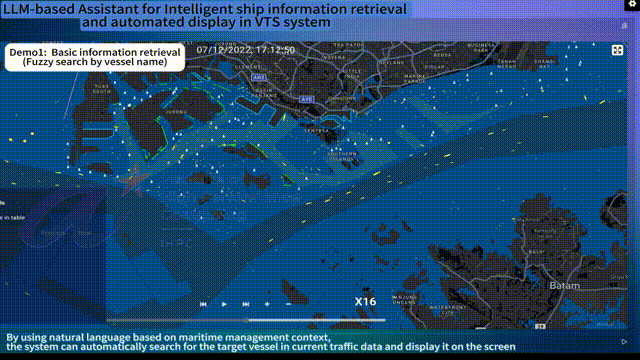

# maritime-vts
ITSC2025 Submitted Paper #549 Official Demo Presentation

- 2025-05-03: Dataset and data is available.
- 2025-05-01: Demo video is available.

## Demo Video



## Dataset

Our dataset is available at [VTS-SQL](https://huggingface.co/datasets/PassbyGrocer/vts-sql).

1. go to `maritime-qa` folder.
```sql
cd maritime-qa
```

2. process xlsx to json.

Select type of vts style: `command`, `operational`, and `natural`.
```sql
python table_to_json.py
```

3. Process origin question to 5 representation type.

It should take some minutes.
```sql
python data_process.py
python dail_sql.py
```

4. Run `ours.py`, `dsql_llm.py` and `sqlcoder_llm.py` to test the models.

note that: add API_KEY into [api.yaml](./maritime-qa/api.yaml). `OpenAI`, `Ollama` and `OpenRoute` is supported. Each example is given.

## Structure

1. RAGFLOW

view [RAGFlow](https://github.com/infiniflow/ragflow) for installing instruction.

## Data
1. shp file data

use [load_shp_data.py](./llm-vts/data/load_shp_data.py) to upload shp file into MYSQL(>=8.0).
- [general](./llm-vts/data/general/)
- [rule](./llm-vts/data/rule/)
- [port](./llm-vts/data/port/)

2. AIS data

Considering that AIS data is confidential, it is recommended to use our own dataset for replication work.

3. Knowledge data

View [VTS-SQL](https://huggingface.co/datasets/PassbyGrocer/vts-sql) for each required knowledge, add each knowledge into RAGFLOW system.
